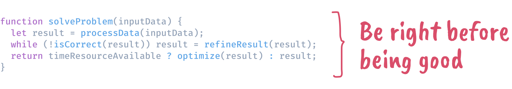

## Hi there 👋, I'm Abhinay 

 

As a seasoned frontend engineer, I've honed my skills in Vue 3 and React.js to build web applications that are not only high-performing but also scalable. Tackling challenges head-on is what I do best, and I'm always eager to dive into projects that push the boundaries of what's possible. At the end of the day, what really drives me is the chance to work on innovative projects that make a genuine difference. 

 

### More About Me
- 💼 &nbsp; Senior Frontend Engineer at [HighLevel](http://gohighlevel.com/)
- 🔭 &nbsp; I’m currently working on **updating my portfolio website**
- 🌱 &nbsp; I’m currently learning about **software architecture**
- 👨🏻‍💻 &nbsp; Most of my projects are available on [Github](https://github.com/thisisabhinay?tab=repositories) and on my [portfolio](https://www.abhinaythakur.com/portfolio).
- 🎨 &nbsp; Apart from being a frontend engineer I also have professional experience with UX/UI design. Checkout my [Dribbble](https://dribbble.com/thisisabhinay) for past work.
- 💬 &nbsp; [Ask me](https://calendly.com/abhinaythakur/30min) about anything tech related, I am happy to help.
- 📫 &nbsp; Feel free to ping me on [LinkedIn](https://www.linkedin.com/in/thisisabhinay/)
- 📝 &nbsp; Checkout my [resume](https://www.abhinaythakur.com/resume.pdf)

 

### Languages and Tools

  
  
  
  
  
  
  
  
  
  
  
  
  
  
  
  
  
  
  
  
  
  
  
  
  
  
  
  
  
  
  
  
  
  
  
  
  
  
  
  
  
  

